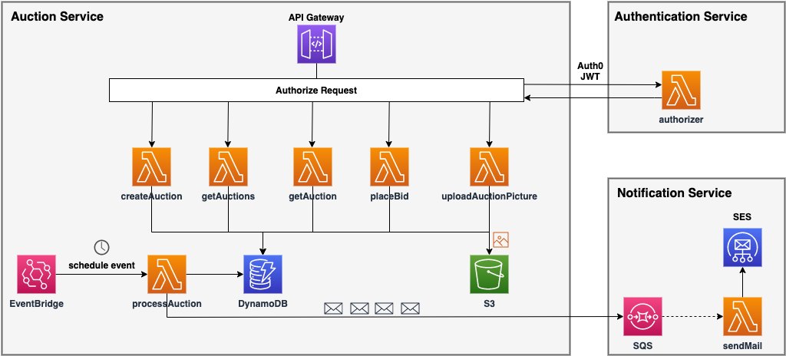

# Serverless Framework Bootcamp: Node.js, AWS & Microservices

This application was developped while taking a course on Udemy:
https://www.udemy.com/course/serverless-framework/

#### Technologies:
NoSQL database, Web service authentication (Auth0), REST APIs, Microservices Architecture, NodeJS 
#### AWS Services:
Lambda, Identidy and Access Management, Simple Email Service, Simple Queue Service, Notification Service, DynamoDB, CloudFormation, CloudWatch, AWS Budget

